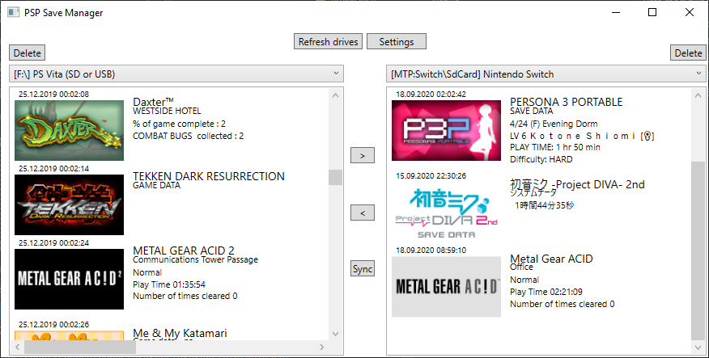

#PSP Save Manager
This is, as the name would suggest, a save manager for PSP save files. 
It automatically scans connected drives and MTP devices to find the right save directories 
Right now it allows you to copy, overwrite and delete saves directly between PPSSPP save folders and real PSP memory cards 
connected as a Windows removable drive and MTP

Tested supported devices:
- Real PSP memory card connected directly to PC
- PS Vita (vitashell USB)
- Nintendo Switch over MTP
- Android over MTP
In addition to those you can add your own directories

Devices not currently supported:
- Unmodded PS Vita
- Anything over FTP